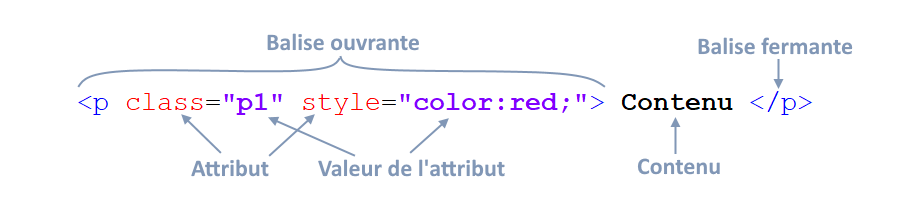
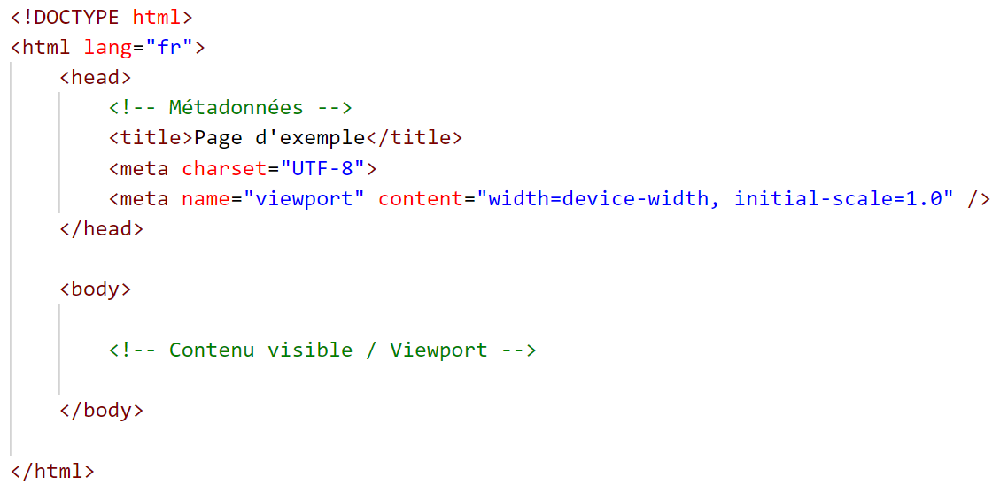
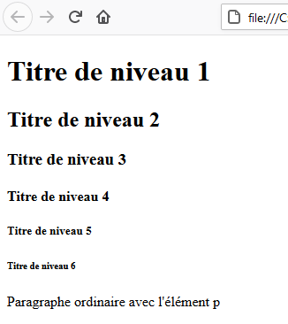
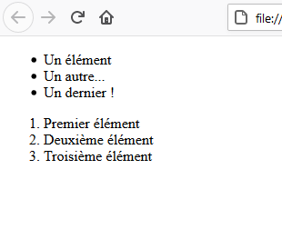
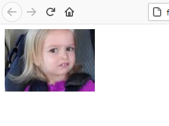
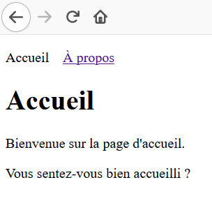
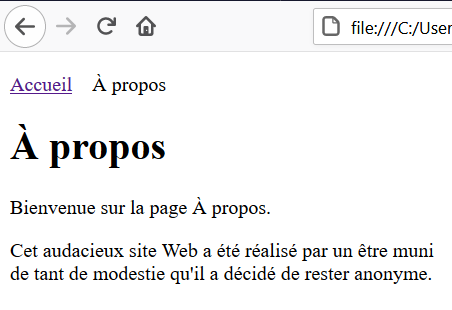
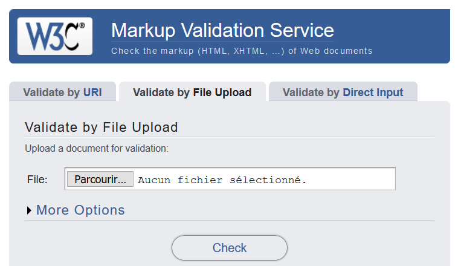
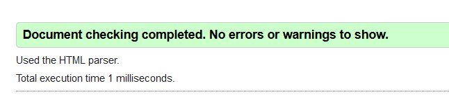

# Introduction à HTML

HTML est le langage qui décrit la **structure** d’une page Web. Il permet d’indiquer au navigateur ce qui est un titre, un paragraphe, une image, une liste ou un lien.


Dans cette introduction, nous allons construire une première page, comprendre sa structure et relier deux pages entre elles.

## Objectifs

À la fin de ce chapitre, vous serez en mesure de :

- reconnaître une balise ouvrante et une balise fermante;
- créer la structure minimale d’un document HTML;
- ajouter des titres, des paragraphes, des listes et des images;
- créer des liens entre plusieurs pages;
- vérifier votre code avec le validateur du W3C.

## 1. Une première page Web

Créez un fichier nommé `index.html`, puis ajoutez le code suivant :

```html
<!doctype html>
<html lang="fr">
  <head>
    <meta charset="UTF-8">
    <meta name="viewport" content="width=device-width, initial-scale=1.0">
    <title>Ma première page</title>
  </head>
  <body>
    <h1>Bienvenue sur ma page</h1>
    <p>Je viens de créer ma première page Web.</p>
  </body>
</html>
```

Ouvrez ensuite le fichier dans un navigateur. Le navigateur interprète le HTML et affiche le titre et le paragraphe. Il ne montre pas les balises elles-mêmes.

> HTML décrit le contenu. La mise en forme visuelle sera principalement le rôle de CSS.

## 2. Comprendre les éléments HTML

Un document HTML est composé d’**éléments**. La plupart des éléments possèdent :

1. une balise ouvrante;
2. un contenu;
3. une balise fermante.

```html
<p>Ceci est un paragraphe.</p>
```

Dans cet exemple :

- `<p>` ouvre l’élément;
- `Ceci est un paragraphe.` est son contenu;
- `</p>` ferme l’élément.



### Les attributs

Une balise ouvrante peut contenir des **attributs**. Un attribut donne une information supplémentaire sur l’élément.

```html
<p class="introduction">Bienvenue!</p>
```

Ici, l’attribut `class` possède la valeur `introduction`. La valeur est placée entre guillemets.

### Quelques éléments sans balise fermante

Certains éléments ne contiennent pas de texte et n’ont pas de balise fermante. C’est notamment le cas de :

```html
<br>
<hr>

```

- `<br>` insère un saut de ligne;
- `<hr>` marque une séparation thématique;
- `` insère une image.

## 3. Imbriquer les éléments correctement

Un élément peut en contenir un autre. On parle alors d’**imbrication**.

```html
<p>Ce mot est <strong>important</strong>.</p>
```

Les balises doivent se fermer dans l’ordre inverse de leur ouverture. On peut comparer les éléments à des boîtes placées les unes dans les autres.

Code correctement imbriqué :

```html
<p>Cinq chiens <strong><em>chassent</em></strong> six chats.</p>
```

Code incorrect, parce que les balises se croisent :

```html
<p>Cinq chiens <strong><em>chassent</strong></em> six chats.</p>
```

L’indentation aide à voir la structure :

```html
<body>
  <div>
    <p>
      Un paragraphe avec un mot <strong>important</strong>.
    </p>
  </div>
</body>
```

## 4. La structure d’un document HTML



Chaque partie du document joue un rôle précis.

### `<!doctype html>`

Cette déclaration indique au navigateur qu’il doit interpréter le document comme du HTML moderne. Elle apparaît tout au début du fichier.

### `<html>`

L’élément `<html>` contient tout le document, sauf la déclaration `<!doctype html>`. L’attribut `lang="fr"` indique que le contenu est en français.

### `<head>`

L’élément `<head>` contient des informations sur la page qui ne font pas partie du contenu principal affiché :

```html
<head>
  <meta charset="UTF-8">
  <meta name="viewport" content="width=device-width, initial-scale=1.0">
  <meta name="description" content="Une courte description de la page">
  <title>Titre affiché dans l’onglet</title>
</head>
```

- `charset="UTF-8"` permet d’utiliser correctement les caractères accentués;
- `viewport` adapte l’affichage à la largeur de l’appareil;
- `description` résume le contenu de la page;
- `<title>` détermine le texte affiché dans l’onglet du navigateur.

### `<body>`

L’élément `<body>` contient ce que la personne voit dans la page : titres, paragraphes, images, listes, liens, formulaires et autres contenus.

## 5. Structurer le contenu visible

### Les titres

HTML propose six niveaux de titres, de `<h1>` à `<h6>`.

```html
<h1>Titre principal de la page</h1>
<h2>Une grande section</h2>
<h3>Une sous-section</h3>
```

Le niveau indique la place du titre dans la structure du document. On choisit donc un niveau pour son sens, et non simplement pour obtenir une taille de caractères particulière.



### Les paragraphes et les sauts de ligne

L’élément `<p>` représente un paragraphe :

```html
<p>Voici mon premier paragraphe.</p>
<p>Voici un deuxième paragraphe.</p>
```

Les retours à la ligne ajoutés dans le fichier HTML ne sont généralement pas reproduits tels quels par le navigateur. Lorsqu’un saut de ligne fait partie du contenu, par exemple dans une adresse ou un poème, on peut employer `<br>` :

```html
<p>
  123, rue du Web<br>
  Montréal (Québec)<br>
  H0H 0H0
</p>
```

Pour séparer de vrais paragraphes, utilisez plutôt plusieurs éléments `<p>`.

### Mettre l’accent sur un passage

```html
<p>
  Cette consigne est <strong>importante</strong> et ce mot reçoit
  une <em>emphase</em> particulière.
</p>
```

- `<strong>` indique une importance forte;
- `<em>` indique une emphase.

Le navigateur les affiche habituellement en gras et en italique, mais leur rôle principal est de donner du sens au texte.

### Les listes

Une liste à puces utilise `<ul>`, alors qu’une liste numérotée utilise `<ol>`. Chaque élément de la liste est placé dans `<li>`.

```html
<h2>Ingrédients</h2>
<ul>
  <li>Pain</li>
  <li>Fromage</li>
  <li>Tomate</li>
</ul>

<h2>Étapes</h2>
<ol>
  <li>Préparer les ingrédients.</li>
  <li>Assembler le sandwich.</li>
  <li>Servir.</li>
</ol>
```



Une liste peut aussi être placée dans un élément `<li>` pour créer un niveau supplémentaire.

## 6. Ajouter une image

L’élément `` utilise principalement deux attributs :

```html

```

- `src` indique où se trouve le fichier;
- `alt` fournit une solution textuelle lorsque l’image ne peut pas être vue.



Le texte alternatif doit transmettre la fonction ou l’information importante de l’image. Une description comme `image123.png` n’aide pas la personne qui utilise un lecteur d’écran.

### Comprendre les chemins relatifs

Supposons la structure suivante :

```text
mon-site/
├── index.html
└── images/
    └── chat.png
```

Depuis `index.html`, le chemin vers l’image est :

```html

```

Quelques repères :

- `chat.png` désigne un fichier dans le même dossier que la page;
- `images/chat.png` entre dans le sous-dossier `images`;
- `../chat.png` remonte au dossier parent;
- `https://exemple.com/chat.png` est une adresse absolue vers un autre site.

Pour les travaux du cours, conservez de préférence les images dans le projet. Cela évite de dépendre d’un autre site et permet de vérifier les droits d’utilisation des fichiers.

## 7. Relier plusieurs pages

L’élément `<a>` crée un lien. Son attribut `href` indique la destination.

```html
<a href="a-propos.html">À propos</a>
```

Pour relier deux pages placées dans le même dossier, on peut ajouter la même navigation dans chacune :

```html
<nav>
  <a href="index.html">Accueil</a>
  <a href="a-propos.html">À propos</a>
</nav>
```

Page d’accueil :



Page À propos :



Un lien peut aussi mener vers un site externe :

```html
<a href="https://www.w3.org/">Visiter le site du W3C</a>
```

Le contenu entre `<a>` et `</a>` devient cliquable. Il peut s’agir de texte ou même d’une image.

## 8. Commentaires

Un commentaire documente le code sans apparaître dans la page :

```html
<!-- Navigation principale du site -->
<nav>
  <a href="index.html">Accueil</a>
</nav>
```

## 9. Valider le document

Une page peut sembler fonctionner même si son HTML contient des erreurs. La validation aide notamment à repérer :

- une balise fermante oubliée;
- des balises croisées;
- une faute dans le nom d’un élément ou d’un attribut;
- une structure de document incomplète.

Le [validateur du W3C](https://validator.w3.org/) permet de téléverser un fichier HTML et d’obtenir une liste d’erreurs.



Corrigez les erreurs une à une, puis relancez la validation jusqu’à obtenir un document sans erreur.



La validation ne garantit pas que la page est agréable ou facile à utiliser. Elle confirme surtout que sa syntaxe et sa structure respectent les règles du langage.

## À retenir

- HTML décrit la structure et le sens du contenu d’une page Web.
- La plupart des éléments utilisent une balise ouvrante et une balise fermante.
- Les éléments imbriqués doivent se fermer dans le bon ordre.
- `<head>` décrit la page; `<body>` contient le contenu visible.
- Les chemins relatifs relient les pages et les fichiers d’un même projet.
- Un texte alternatif pertinent rend les images plus accessibles.
- La validation permet de détecter de nombreuses erreurs de syntaxe.

---

*Adaptation éditoriale du document « R01 — Introduction à HTML », diapositives 1 à 52. Les médias originaux du PowerPoint sont conservés dans `assets/originaux/` et leur correspondance avec les diapositives figure dans `inventaire-source.json`.*
