# Introduction à CSS

HTML décrit la structure d’une page Web. CSS contrôle son apparence : couleurs, dimensions, bordures, alignement, espacements et typographie.


Une même feuille de styles peut être utilisée par plusieurs pages. Elle permet donc de garder une apparence cohérente sans répéter les mêmes réglages partout.

## Objectifs

À la fin de ce chapitre, vous serez en mesure de :

- reconnaître la syntaxe d’une règle CSS;
- relier une feuille de styles à une page HTML;
- sélectionner des éléments par leur nom, leur classe ou leur identifiant;
- comprendre simplement pourquoi une règle peut en remplacer une autre;
- modifier les couleurs, les bordures, l’alignement et la typographie;
- choisir des éléments HTML appropriés pour regrouper le contenu.

## 1. Ajouter un premier style

Voici un paragraphe HTML auquel on applique directement une couleur :

```html
<p style="color: violet;">Un paragraphe violet.</p>
```

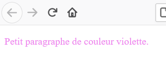

La portion `color: violet;` est du CSS :

- `color` est une **propriété**;
- `violet` est sa **valeur**;
- les deux-points séparent la propriété de sa valeur;
- le point-virgule termine la déclaration.

Une déclaration CSS suit donc cette forme :

```css
propriete: valeur;
```

Plusieurs déclarations peuvent être réunies dans une même règle :

```css
p {
  color: navy;
  font-size: 1.2rem;
  border: 2px solid steelblue;
}
```

Le navigateur applique ici les trois déclarations à tous les paragraphes `<p>`.

## 2. Trois façons d’ajouter du CSS

### Le CSS intraligne

Le CSS intraligne est placé dans l’attribut `style` d’un élément HTML :

```html
<p style="color: red;">Un paragraphe rouge.</p>
```

Cette méthode peut dépanner pour un essai très court, mais elle mélange la structure HTML et la présentation. Elle devient rapidement difficile à maintenir.

### Le CSS interne

Le CSS interne est placé dans un élément `<style>` à l’intérieur de `<head>` :

```html
<head>
  <meta charset="UTF-8">
  <title>Ma page</title>

  <style>
    p {
      color: blue;
    }
  </style>
</head>
```

Il peut être pratique pour une démonstration ou pour une page qui possède quelques styles uniques.

### Le CSS externe

La méthode à privilégier consiste à placer les règles dans un fichier séparé, par exemple `styles.css`.

```css
body {
  font-family: Arial, sans-serif;
}

h1 {
  color: darkblue;
}
```

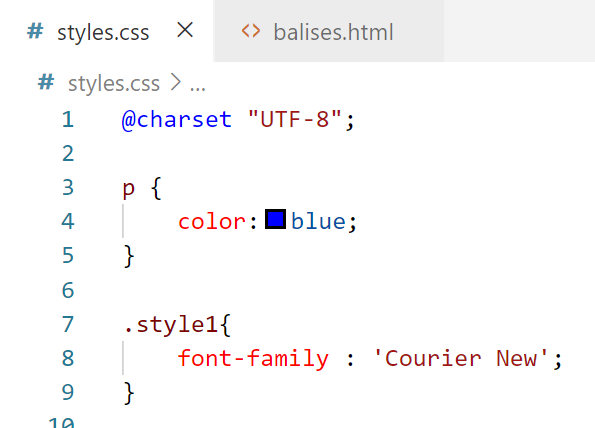

La page HTML doit ensuite charger ce fichier avec `<link>` :

```html
<head>
  <meta charset="UTF-8">
  <meta name="viewport" content="width=device-width, initial-scale=1.0">
  <title>Ma page</title>
  <link rel="stylesheet" href="styles.css">
</head>
```

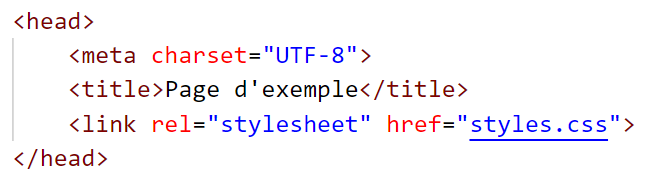

Le chemin dans `href` fonctionne comme le chemin d’une image ou d’un lien HTML. Si le fichier se trouve dans un sous-dossier nommé `css`, on écrit plutôt :

```html
<link rel="stylesheet" href="css/styles.css">
```

## 3. Les sélecteurs indiquent quoi modifier

Une règle CSS commence par un **sélecteur**. Le sélecteur indique quels éléments recevront les déclarations placées entre les accolades.

```css
selecteur {
  propriete: valeur;
}
```

### Sélectionner un type d’élément

Le nom d’un élément HTML sélectionne tous les éléments de ce type :

```css
p {
  color: blue;
}

h1 {
  font-size: 2.5rem;
}
```

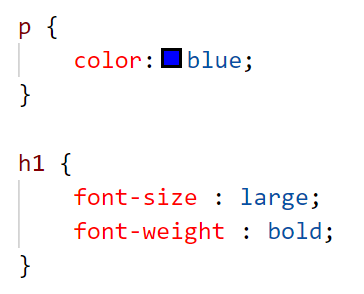

La première règle vise tous les paragraphes. La deuxième vise tous les titres `<h1>`.

### Sélectionner une classe

Une **classe** permet de cibler certains éléments seulement. Son nom commence par un point dans la feuille CSS :

```css
.important {
  color: firebrick;
  font-weight: bold;
}
```

Dans le HTML, on applique la classe sans écrire le point :

```html
<p>Un paragraphe ordinaire.</p>
<p class="important">Un paragraphe important.</p>
```

Une classe peut être réutilisée sur plusieurs éléments. Un élément peut aussi posséder plusieurs classes, séparées par des espaces :

```html
<p class="important introduction">Bienvenue!</p>
```

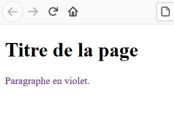

### Sélectionner un identifiant

Un identifiant est écrit avec `id` dans le HTML et avec un dièse dans le CSS :

```html
<p id="message-principal">Bienvenue sur le site.</p>
```

```css
#message-principal {
  color: darkgreen;
}
```

Un identifiant doit être unique dans une page. Pour un style qui doit être réutilisé, préférez une classe.

## 4. Quand plusieurs règles visent le même élément

CSS signifie *Cascading Style Sheets*, ou feuilles de styles en cascade. Plusieurs règles peuvent viser le même élément. Le navigateur doit alors déterminer lesquelles s’appliquent.

```html
<p class="avertissement">Attention!</p>
```

```css
p {
  color: black;
}

.avertissement {
  color: red;
}
```

Le paragraphe devient rouge parce que le sélecteur de classe est plus précis que le sélecteur d’élément.

Pour les cas simples de ce cours, retenez cet ordre général :

```text
style intraligne > identifiant > classe > type d’élément
```

Lorsque deux règles ont la même précision, celle écrite plus bas dans la feuille gagne généralement.

La meilleure stratégie reste d’éviter les conflits inutiles : choisissez des classes claires et regroupez les styles liés au même composant.

## 5. Regrouper du contenu

Il est souvent utile de regrouper plusieurs éléments pour leur appliquer un même style.

### Regrouper une section avec `<div>`

```html
<div class="encadre">
  <h2>À retenir</h2>
  <p>Cette section forme un seul groupe.</p>
  <p>La classe est appliquée au groupe complet.</p>
</div>
```

```css
.encadre {
  background-color: aliceblue;
  border: 2px solid steelblue;
}
```

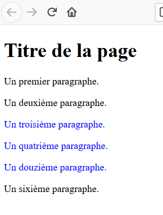

`<div>` est un conteneur général. Il est utile lorsqu’aucun élément plus précis ne décrit le groupe.

### Cibler une portion de texte avec `<span>`

`<span>` permet de cibler une petite portion à l’intérieur d’un texte :

```html
<p>Ce mot est <span class="mot-cle">important</span>.</p>
```

```css
.mot-cle {
  color: darkred;
  font-weight: bold;
}
```

### Préférer les conteneurs sémantiques lorsqu’ils conviennent

HTML fournit des éléments qui expliquent le rôle d’une section :

- `<header>` représente l’en-tête d’une page ou d’une section;
- `<nav>` contient un groupe important de liens de navigation;
- `<main>` contient le contenu principal propre à la page;
- `<footer>` représente le pied d’une page ou d’une section.

```html
<body>
  <header>
    <h1>Mon site</h1>
  </header>

  <nav>
    <a href="index.html">Accueil</a>
    <a href="a-propos.html">À propos</a>
  </nav>

  <main>
    <h2>Bienvenue</h2>
    <p>Voici le contenu principal de cette page.</p>
  </main>

  <footer>
    <p>Mon site Web</p>
  </footer>
</body>
```

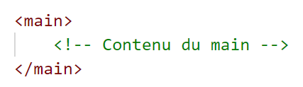

Ces éléments peuvent recevoir des classes et des styles exactement comme un `<div>`, tout en donnant plus de sens à la structure.

## 6. Couleurs et arrière-plans

La propriété `color` modifie la couleur du texte. `background-color` modifie la couleur de fond.

```css
h1 {
  color: mediumturquoise;
}

.message {
  color: darkslateblue;
  background-color: mistyrose;
}
```

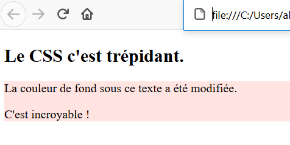

Une couleur peut être exprimée par un nom ou un code hexadécimal :

```css
.message {
  color: #244a7c;
  background-color: #eaf3ff;
}
```

Le dièse suivi de six caractères décrit les quantités de rouge, de vert et de bleu qui composent la couleur.

## 7. Ajouter une bordure

La propriété raccourcie `border` réunit généralement trois valeurs :

```css
.encadre {
  border: 2px solid orchid;
}
```

Dans cet ordre, les valeurs représentent :

1. l’épaisseur de la bordure;
2. son style;
3. sa couleur.

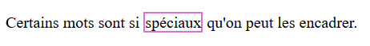

Quelques styles de bordure courants :

```css
.continue {
  border: 2px solid black;
}

.pointillee {
  border: 2px dashed black;
}
```

## 8. Aligner et décorer le texte

### Alignement

La propriété `text-align` contrôle l’alignement horizontal du texte dans son conteneur :

```css
h1 {
  text-align: center;
}

.signature {
  text-align: right;
}
```

Les valeurs courantes sont `left`, `center`, `right` et `justify`.

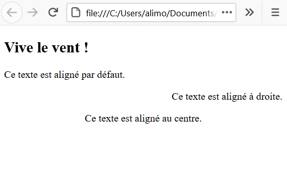

### Décoration

La propriété `text-decoration` ajoute ou retire une ligne autour du texte :

```css
a {
  text-decoration: none;
}

.souligne {
  text-decoration: underline;
}

.retire {
  text-decoration: line-through;
}
```

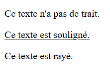

Évitez de retirer le soulignement des liens si aucun autre indice visuel ne permet de reconnaître qu’ils sont cliquables.

## 9. Modifier la typographie

### Famille de caractères

`font-family` indique la police souhaitée. On fournit plusieurs choix afin que le navigateur puisse utiliser une solution de remplacement :

```css
body {
  font-family: Verdana, Arial, sans-serif;
}
```

Un nom contenant des espaces est placé entre guillemets :

```css
h1 {
  font-family: "Trebuchet MS", Arial, sans-serif;
}
```

### Style de police

```css
.citation {
  font-style: italic;
}
```

Les valeurs les plus utiles au début sont `normal` et `italic`.

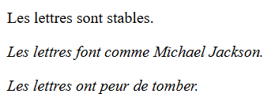

### Taille du texte

```css
body {
  font-size: 1rem;
}

h1 {
  font-size: 2rem;
}
```

L’unité `rem` calcule la taille à partir de la taille de référence du document. Ainsi, `2rem` correspond à deux fois cette taille de référence.

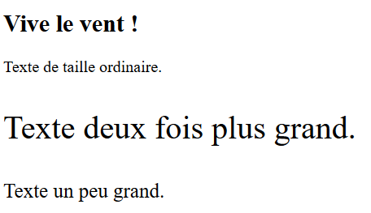

## 10. Exemple complet

Voici une petite page qui réunit les principales notions du chapitre.

### `index.html`

```html
<!doctype html>
<html lang="fr">
  <head>
    <meta charset="UTF-8">
    <meta name="viewport" content="width=device-width, initial-scale=1.0">
    <title>Mon site</title>
    <link rel="stylesheet" href="styles.css">
  </head>
  <body>
    <header class="entete">
      <h1>Mon site</h1>
    </header>

    <main>
      <h2>Bienvenue</h2>
      <p>Voici une première page mise en forme avec CSS.</p>
      <p class="message">Ce paragraphe reçoit un style particulier.</p>
    </main>
  </body>
</html>
```

### `styles.css`

```css
body {
  font-family: Arial, sans-serif;
  color: #263238;
}

.entete {
  color: white;
  background-color: #245a86;
  text-align: center;
}

.message {
  background-color: #eaf3ff;
  border: 2px solid #245a86;
}
```

## À retenir

- CSS contrôle l’apparence des éléments HTML.
- Une déclaration réunit une propriété et une valeur.
- Une feuille externe permet de partager les mêmes styles entre plusieurs pages.
- Un sélecteur d’élément vise un type de balise; une classe peut être réutilisée.
- Les règles plus précises peuvent remplacer les règles plus générales.
- `<div>` et `<span>` sont des conteneurs généraux; les éléments sémantiques décrivent le rôle du contenu.
- Les couleurs, bordures et propriétés typographiques peuvent être combinées dans une même règle.

---

*Adaptation éditoriale du document « R02 — Introduction à CSS », diapositives 1 à 34. Les médias originaux du PowerPoint sont conservés dans `assets/originaux/` et leur correspondance avec les diapositives figure dans `inventaire-source.json`.*
