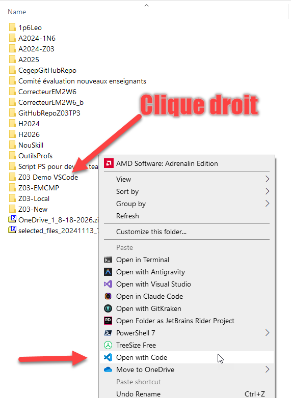
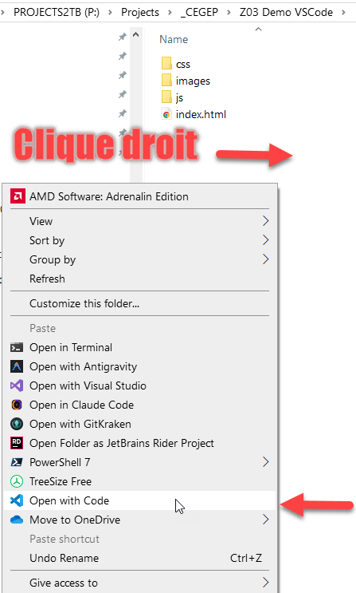
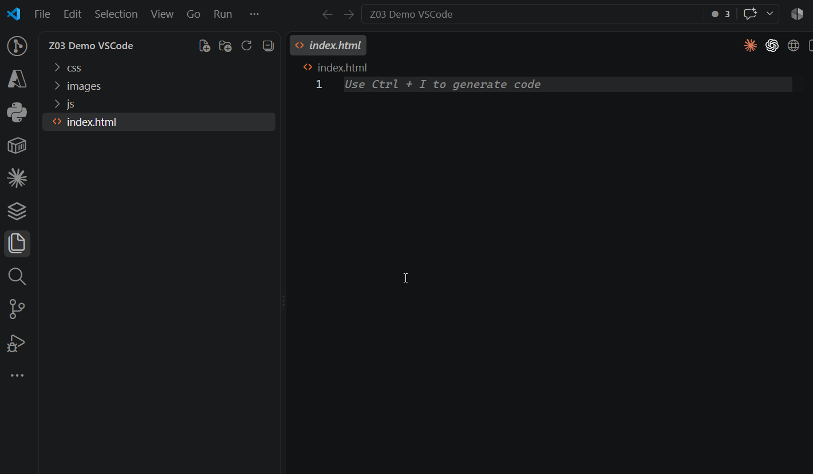
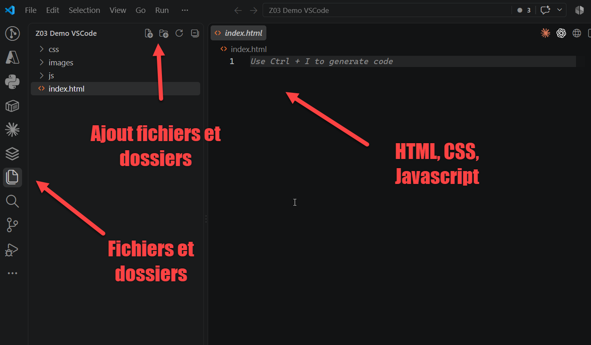

# Préambule - Environnement de travail

Avant de commencer HTML, vous devez être capable de **retrouver vos fichiers, les organiser et les ouvrir avec les bons outils**.

Cette partie ne porte pas encore sur la programmation. Elle sert à préparer un environnement de travail fiable pour le reste de la session.

## Objectifs

À la fin de ce préambule, vous devriez être capable de :

- conserver vos fichiers dans un emplacement qui ne sera pas perdu en changeant de poste;
- reconnaître une arborescence de dossiers;
- créer, nommer et retrouver un dossier;
- reconnaître les principales extensions de fichiers utilisées dans le cours;
- afficher les extensions de fichiers dans Windows;
- comprendre à quoi sert un fichier ZIP et l'extraire avant de travailler;
- ouvrir **un dossier complet** dans VS Code;
- reconnaître l'Explorateur de VS Code et créer un fichier dans le bon dossier;
- comprendre que VS Code modifie de vrais fichiers présents sur l'ordinateur ou dans OneDrive;
- ouvrir une page HTML dans le navigateur et l'actualiser après une modification.

## 1. Où conserver vos fichiers

:::warning Ne laissez pas votre travail seulement sur un poste du cégep
Les fichiers enregistrés uniquement sur un ordinateur du cégep peuvent être perdus lorsque vous fermez votre session ou changez de poste.
:::

Pour le cours, conservez votre travail dans votre espace **OneDrive** scolaire.

Une organisation simple pourrait être :

```text
OneDrive/
└── Z03/
```

Tous vos projets du cours pourront être rangés dans ce dossier.

:::tip Bonne pratique
Une clé USB peut servir de copie supplémentaire, mais évitez de dépendre d'un seul support physique pour votre travail.
:::

## 2. Comprendre l'arborescence des dossiers

Les fichiers et les dossiers sont organisés sous forme d'**arborescence** : un dossier peut contenir d'autres dossiers, qui peuvent eux-mêmes contenir des fichiers.

Par exemple :

```text
OneDrive/
└── Z03/
    ├── exercice-rencontre1/
    │   └── index.html
    └── mon-site/
        └── index.html
```

Dans cet exemple :

- `Z03` contient deux dossiers;
- `exercice-rencontre1` contient un fichier `index.html`;
- `mon-site` contient un autre fichier qui porte aussi le nom `index.html`.

Deux fichiers peuvent avoir le même nom s'ils ne se trouvent pas dans le même dossier.

### La racine

La **racine** est le point de départ d'une arborescence ou d'un projet.

Dans Windows, vous pouvez partir de **Ce PC**, puis accéder à vos disques, à une clé USB ou à votre espace OneDrive.

Dans un projet Web, on parlera aussi du **dossier racine du projet** : c'est le dossier qui contient l'ensemble des fichiers du site.

## 3. Créer et nommer des dossiers

Pour créer un dossier dans Windows, placez-vous d'abord à l'endroit où vous voulez le créer, puis utilisez la commande permettant de créer un **nouveau dossier**.

Pour le cours, privilégiez des noms simples :

```text
Z03
mon-site
exercice-rencontre1
images
pages
```

:::tip Bonne pratique
Pour les fichiers et dossiers utilisés dans un site Web, privilégiez des noms courts, en minuscules, sans espace et sans accent.

Par exemple : `mon-site` est préférable à `Mon super site Web`.
:::

## 4. Les extensions de fichiers

L'**extension** est la partie du nom située après le dernier point. Elle indique généralement le type du fichier.

Quelques extensions que vous rencontrerez pendant le cours :

```text
.html    page Web HTML
.css     feuille de styles CSS
.js      code JavaScript
.jpg     image JPEG
.png     image PNG
.txt     fichier texte simple
.pdf     document PDF
.zip     archive compressée
```

Un fichier nommé :

```text
index.html
```

est donc un fichier HTML.

Mais :

```text
index.html.txt
```

est un fichier texte.

:::warning Affichez les extensions dans Windows
Windows peut masquer les extensions connues. Activez l'option **Extensions de noms de fichiers** dans l'Explorateur afin de toujours voir le vrai nom des fichiers avec lesquels vous travaillez.
:::

## 5. Les fichiers ZIP

Un fichier `.zip` est une **archive** qui regroupe plusieurs fichiers ou dossiers dans un seul fichier.

Les ZIP sont pratiques pour télécharger, transporter ou remettre un projet complet.

### Extraire avant de travailler

Lorsque vous téléchargez une archive ZIP pour un exercice ou un laboratoire :

1. placez le fichier ZIP dans un endroit que vous retrouverez facilement;
2. utilisez **Extraire tout** ou une commande équivalente;
3. choisissez le dossier où le contenu doit être extrait;
4. ouvrez ensuite **le dossier extrait** dans VS Code.

:::danger Ne travaillez pas directement dans une archive
Si vous voyez le contenu d'un ZIP dans une interface d'archive, ne commencez pas à modifier les fichiers à cet endroit.

Extrayez d'abord l'archive. Vous éviterez ainsi des fichiers qui semblent enregistrés mais qui ne se trouvent pas là où vous pensez.
:::

### Compresser un dossier

La compression fait l'opération inverse : elle crée une archive ZIP contenant une copie des fichiers sélectionnés.

Vous n'aurez pas nécessairement besoin de compresser un projet à chaque rencontre, mais cette opération pourra être utile lorsqu'un projet complet doit être transmis ou conservé.

## 6. Ouvrir un projet dans VS Code

**Visual Studio Code (VS Code)** est l'éditeur que nous utiliserons pour modifier nos fichiers HTML, CSS et JavaScript.

Le principe le plus important est le suivant :

:::info VS Code ne contient pas votre projet
Votre projet existe dans un vrai dossier de Windows ou de OneDrive. VS Code vous permet simplement **d'ouvrir ce dossier et de modifier les fichiers qui s'y trouvent**.
:::

Les captures ci-dessous peuvent différer légèrement de votre version de Windows ou de VS Code. Ce qui compte est de reconnaître **le dossier du projet** et l'action qui permet de l'ouvrir dans VS Code.

### Méthode 1 — Ouvrir le dossier depuis Windows

La façon la plus directe est de repérer le dossier du projet dans l'Explorateur de fichiers de Windows, puis de faire un **clic droit sur le dossier** et de choisir la commande qui l'ouvre avec VS Code.



Si vous êtes déjà **à l'intérieur du dossier**, vous pouvez aussi utiliser le clic droit dans le dossier et choisir l'ouverture avec VS Code.



:::tip Le bon réflexe
Ouvrez le **dossier du projet**, pas seulement un fichier comme `index.html`. Cela permet à VS Code de voir toute l'arborescence du site : pages, images, feuilles CSS et fichiers JavaScript.
:::

### Méthode 2 — Ouvrir le dossier depuis VS Code

Vous pouvez aussi démarrer VS Code normalement.



Dans VS Code :

1. choisissez **Fichier → Ouvrir le dossier**;
2. sélectionnez le dossier sur lequel vous voulez travailler;
3. vérifiez que son contenu apparaît dans l'**Explorateur** à gauche de la fenêtre.

Une fois le dossier ouvert, vous devez pouvoir reconnaître le nom du projet et ses fichiers dans l'Explorateur de VS Code.



Par exemple, pour un petit projet nommé `mon-site`, on pourrait avoir :

```text
MON-SITE
└── index.html
```

### Créer un fichier

Lorsque vous créez un fichier dans l'Explorateur de VS Code, ce fichier est réellement créé dans le dossier ouvert.

Si vous créez `index.html`, vous devriez donc aussi pouvoir le retrouver avec l'Explorateur de fichiers de Windows.

:::tip Bonne pratique
Avant de commencer à coder, regardez toujours le nom du dossier affiché dans l'Explorateur de VS Code. Vous saurez ainsi immédiatement **dans quel projet** vous êtes en train de travailler.
:::

## 7. VS Code et le navigateur ont deux rôles différents

VS Code sert à **modifier le code**.

Le navigateur sert à **interpréter et afficher la page Web**.

Pendant une grande partie du cours, vous répéterez ce cycle :

```text
modifier dans VS Code
        ↓
enregistrer le fichier
        ↓
actualiser le navigateur
        ↓
observer le résultat
```

Si une modification ne semble pas apparaître dans le navigateur, vérifiez d'abord que vous avez enregistré le fichier et que vous regardez la bonne page.

## 8. Avant de commencer HTML

Vérifiez que vous pouvez faire chacune de ces actions :

- [ ] ouvrir votre espace OneDrive;
- [ ] retrouver ou créer votre dossier `Z03`;
- [ ] créer un sous-dossier et le renommer;
- [ ] voir les extensions de fichiers dans Windows;
- [ ] reconnaître un fichier `.html`, `.jpg`, `.zip` ou `.txt`;
- [ ] extraire une archive ZIP avant d'utiliser son contenu;
- [ ] ouvrir un dossier complet dans VS Code depuis Windows ou depuis VS Code;
- [ ] repérer le nom du projet dans l'Explorateur de VS Code;
- [ ] créer et enregistrer un fichier;
- [ ] retrouver le même fichier dans Windows;
- [ ] ouvrir une page HTML dans un navigateur et l'actualiser.

Il n'y a aucune validation sommative associée à cette partie. Ces habitudes servent de fondation au reste du cours.

## Continuer la rencontre 1

Votre environnement est prêt. Vous pouvez maintenant commencer le langage HTML :

**[Continuer vers Cours — Premiers pas en HTML](./01-rencontre1.md)**
