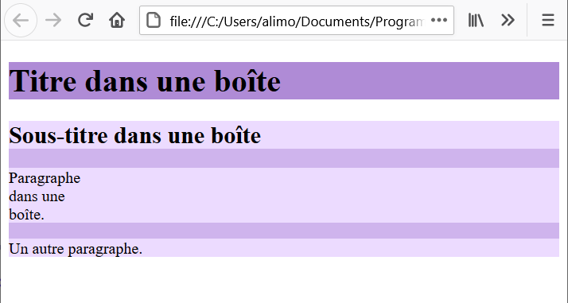
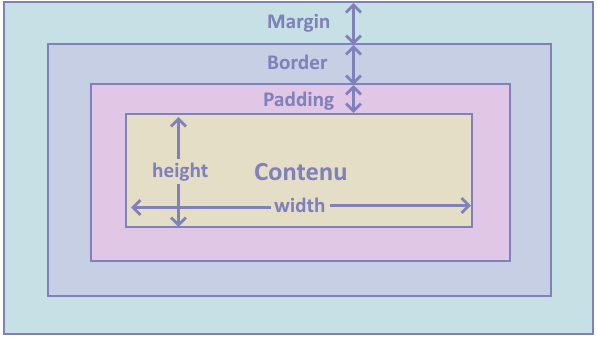
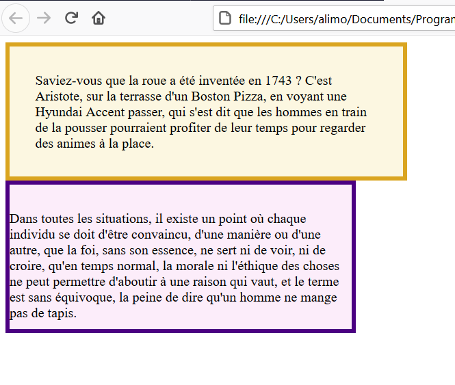
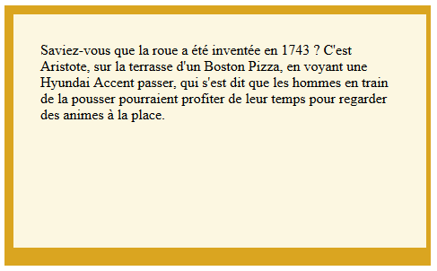

# Rencontre 4 - Modèle en boîte et espacements

À la rencontre 3, vous avez appris à relier une feuille CSS, à utiliser des sélecteurs et à appliquer des propriétés visuelles.

Aujourd'hui, nous allons répondre à une question très fréquente en CSS :

> **Où dois-je ajouter de l'espace?**

Pour y répondre, il faut comprendre le **modèle en boîte**.

## Objectifs de la rencontre

À la fin de la rencontre, vous devriez être capable de :

- expliquer que chaque élément HTML occupe une boîte;
- nommer les quatre zones du modèle en boîte;
- distinguer `padding` et `margin`;
- utiliser `padding`, `border` et `margin` volontairement;
- utiliser une forme simple à une ou deux valeurs;
- utiliser une dimension simple lorsqu'elle répond à un besoin réel;
- regrouper du contenu dans un conteneur approprié;
- diagnostiquer un problème d'espacement sans essayer des propriétés au hasard.

## 1. Chaque élément HTML occupe une boîte

Un titre, un paragraphe, une image, une section ou un conteneur occupent tous une zone rectangulaire dans la page.

Cette boîte est parfois difficile à voir parce que son arrière-plan est transparent.

On peut rendre ses limites visibles avec CSS :

```css
.carte {
  background-color: #eaf3ff;
  border: 2px solid #245a86;
}
```



:::tip Bonne pratique — rendre la boîte visible pour comprendre
Lorsque vous ne comprenez pas pourquoi un élément occupe trop ou trop peu d'espace, ajouter temporairement une couleur d'arrière-plan ou une bordure peut aider à voir ses limites.
:::

## 2. Les quatre zones du modèle en boîte

Le modèle se lit du centre vers l'extérieur :

1. **contenu** : texte, image ou éléments enfants;
2. **padding** : espace entre le contenu et la bordure;
3. **border** : ligne qui entoure le padding;
4. **margin** : espace extérieur qui sépare la boîte de ses voisins.



On peut le représenter simplement ainsi :

```text
margin
┌──────────────────────────────┐
│ border                       │
│  ┌────────────────────────┐  │
│  │ padding                │  │
│  │   contenu              │  │
│  └────────────────────────┘  │
└──────────────────────────────┘
```

:::info À maîtriser
Retenez surtout l'ordre :

```text
contenu → padding → border → margin
```
:::

## 3. `padding` : créer de l'espace à l'intérieur

Supposons cette carte :

```html
<section class="carte">
  <h2>Photo</h2>
  <p>Une activité extérieure.</p>
</section>
```

Avec :

```css
.carte {
  background-color: #eaf3ff;
  border: 2px solid #245a86;
  padding: 20px;
}
```

Le `padding` éloigne le contenu de la bordure.

Il se trouve **dans la zone colorée de la boîte**.

:::info À maîtriser
Si le texte est collé à la bordure, pensez d'abord à `padding`.
:::

## 4. `margin` : créer de l'espace à l'extérieur

Ajoutons maintenant :

```css
.carte {
  background-color: #eaf3ff;
  border: 2px solid #245a86;
  padding: 20px;
  margin: 20px;
}
```

La `margin` crée de l'espace **autour de la boîte**.

Elle sépare la carte des autres éléments.



:::warning Ne pas confondre
`padding` = espace intérieur  
`margin` = espace extérieur
:::

## 5. Une valeur ou deux valeurs

### Une valeur

```css
.carte {
  padding: 20px;
}
```

La même valeur s'applique aux quatre côtés.

### Deux valeurs

```css
.carte {
  padding: 16px 24px;
}
```

Elles se lisent :

```text
16px → haut et bas
24px → gauche et droite
```

Le même principe fonctionne avec `margin` :

```css
.carte {
  margin: 24px 0;
}
```

Ici, la carte reçoit 24 pixels d'espace en haut et en bas, mais pas à gauche ni à droite.

:::tip Bonne pratique
Pour cette rencontre, une ou deux valeurs suffisent dans la majorité des situations. Il n'est pas nécessaire de mémoriser toutes les formes abrégées possibles.
:::

## 6. La bordure fait partie de la boîte

Vous avez déjà utilisé `border` à la rencontre 3 :

```css
.carte {
  border: 2px solid #245a86;
}
```

Maintenant, vous savez où elle se situe :

```text
contenu
↓
padding
↓
border
↓
margin
```

La bordure peut donc servir de repère visuel pour comprendre la différence entre espace intérieur et extérieur.

## 7. Une dimension simple lorsque c'est utile

On peut donner une largeur à une boîte :

```css
.carte {
  width: 320px;
}
```

Cette valeur fixe la largeur de la zone de contenu dans le modèle normal de boîte.

Le `padding` et la bordure utilisent eux aussi de l'espace autour de ce contenu.



Dans un vrai site, il est souvent préférable de ne pas forcer une largeur fixe partout.

Une limite peut être plus souple :

```css
main {
  max-width: 900px;
}
```

:::tip Bonne pratique
Ajoutez une dimension parce qu'elle résout un problème réel, pas simplement pour montrer que vous connaissez la propriété.
:::

:::note Pour aller plus loin — non évalué
Vous pourriez rencontrer :

```css
box-sizing: border-box;
```

Cette propriété peut rendre certaines dimensions plus faciles à prévoir parce qu'elle inclut le `padding` et la bordure dans la largeur déclarée.

Nous n'en faisons pas une exigence de la rencontre.
:::

## 8. Appliquer la boîte à un conteneur

Vous pouvez appliquer ces propriétés à des éléments HTML que vous connaissez déjà :

```html
<header class="entete">...</header>
<section class="carte">...</section>
<main class="contenu">...</main>
```

Lorsque l'élément possède déjà un sens approprié, gardez-le.

### Le conteneur général `<div>`

Parfois, aucun élément plus précis ne décrit le groupe.

Vous pouvez alors utiliser :

```html
<div class="carte">
  <h2>À retenir</h2>
  <p>Cette information forme un groupe visuel.</p>
</div>
```

`<div>` ne possède pas un style particulier par défaut. Il sert surtout de conteneur général auquel on peut appliquer une classe.

:::tip Bonne pratique
Utilisez `<header>`, `<nav>`, `<main>`, `<section>` ou un autre élément approprié lorsqu'il décrit bien le contenu. Utilisez `<div>` lorsqu'aucun élément plus précis n'est nécessaire.
:::

## 9. Exemple complet

HTML :

```html
<main>
  <h1>Activités</h1>

  <section class="carte">
    <h2>Photo</h2>
    <p>Une sortie extérieure pour pratiquer la photographie.</p>
  </section>

  <section class="carte">
    <h2>Cuisine</h2>
    <p>Un atelier pour découvrir une nouvelle recette.</p>
  </section>
</main>
```

CSS :

```css
body {
  font-family: Arial, sans-serif;
  color: #263238;
}

.carte {
  background-color: #eaf3ff;
  border: 2px solid #245a86;
  padding: 20px;
  margin: 24px 0;
}
```

Une seule classe donne le même modèle de boîte aux deux sections.

## 10. Diagnostiquer le bon type d'espace

Avant de modifier le CSS, identifiez le problème.

### Le texte est collé à la bordure

Pensez à :

```css
padding
```

### Deux cartes sont trop près l'une de l'autre

Pensez à :

```css
margin
```

### La ligne autour d'un bloc doit changer

Pensez à :

```css
border
```

### Un bloc est trop large

Une propriété comme :

```css
width
```

ou :

```css
max-width
```

peut être pertinente.

:::info À maîtriser
Le but n'est pas de mémoriser une liste de propriétés. Le but est de choisir la propriété qui correspond à l'endroit où se trouve le problème.
:::

## Ce que nous ne faisons pas aujourd'hui

L'ancien matériel CSS contient aussi des notions comme :

```text
inline-block
overflow
position: absolute
position: fixed
z-index
animations et transitions
```

Ces notions ne font pas partie du noyau de la rencontre 4.

Pour la disposition horizontale du site, nous utiliserons **Flexbox simple à la rencontre 5**.

## À retenir

- chaque élément HTML occupe une boîte;
- le contenu est entouré par `padding`, puis `border`, puis `margin`;
- `padding` crée de l'espace intérieur;
- `margin` crée de l'espace extérieur;
- une ou deux valeurs suffisent pour nos principaux besoins;
- une dimension devrait répondre à un besoin réel;
- une classe permet de réutiliser le même modèle de boîte;
- `<div>` est un conteneur général, pas un remplacement automatique des éléments sémantiques.

## Pratique guidée

**[Exercice guidé — Comprendre le modèle en boîte](./04-rencontre4-exercice-guide.md)**

## Projet Web

**[Projet Web — Étape 4](../03-projet-web/04-rencontre4.md)**

## Validations disponibles

Vous pouvez poursuivre ou reprendre la **Validation C** :

- WEB-05 — feuille CSS externe;
- WEB-06 — sélecteurs.

Vous pouvez aussi commencer la **Validation D** :

- **WEB-07 — Mettre en forme une interface avec CSS**;
- **WEB-08 — Organiser l'espace et la disposition des éléments**.

À cette rencontre, WEB-08 porte surtout sur le modèle en boîte. Flexbox sera ajouté à la rencontre 5.
