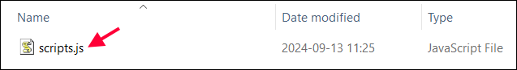
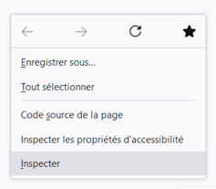
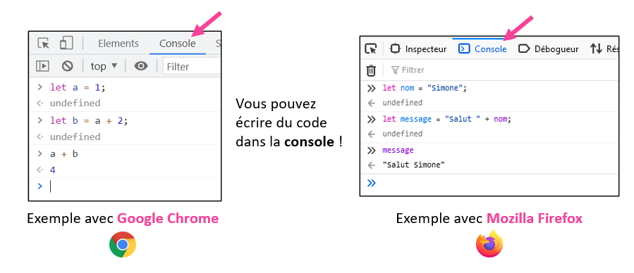
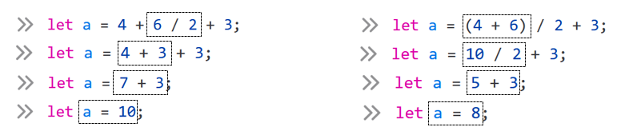
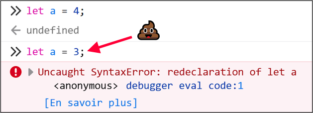
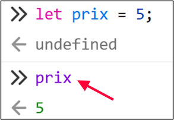

# Rencontre 6 - Variables et affectation

## JavaScript

JavaScript est un langage de programmation très utilisé pour rendre les pages Web **interactives**.

- Les fichiers JavaScript utilisent l'extension `.js`.
- Dans cette première rencontre, nous allons surtout expérimenter directement dans la **console du navigateur**.
- Dès la prochaine rencontre, nous utiliserons JavaScript pour lire et modifier le contenu d'une page Web.

<center></center>

## Utiliser la console du navigateur

Ouvrez la page Web demandée par l'enseignant, puis ouvrez les outils de développement avec `F12` ou avec **clic droit → Inspecter**. Accédez ensuite à l'onglet **Console**.

<center></center>

<center></center>

La console nous permet d'essayer rapidement des instructions JavaScript et d'observer leur résultat.

## Opérateurs arithmétiques

JavaScript peut effectuer des calculs avec les opérateurs suivants :

| Opérateur | Opération | Exemple |
| --- | --- | --- |
| `+` | addition | `5 + 2` |
| `-` | soustraction | `5 - 2` |
| `*` | multiplication | `5 * 2` |
| `/` | division | `5 / 2` |

Pour les nombres décimaux, on utilise un **point** : `4.5`.

Les nombres négatifs s'écrivent avec un `-` devant le nombre : `-12`.

### Priorité des opérations

Comme en mathématiques :

1. les parenthèses `()` sont calculées d'abord;
2. ensuite les multiplications `*` et divisions `/`;
3. ensuite les additions `+` et soustractions `-`.

Par exemple, ces deux expressions ne donnent pas le même résultat :

```js
10 + 5 * 2
(10 + 5) * 2
```

<center></center>

## Variables

Une **variable** permet de conserver une valeur afin de pouvoir la réutiliser ou la modifier plus tard.

Pour commencer, on peut imaginer une variable comme une **case portant un nom**. Cette image est un modèle simplifié pour nous aider à raisonner; JavaScript ne range pas littéralement toutes ses variables dans de petites cases.

### 1. Déclarer une variable

**Déclarer** une variable signifie **créer la variable**.

```js
let score;
```

Le mot-clé `let` indique à JavaScript : « crée une variable qui s'appelle `score` ».

On peut se représenter le résultat ainsi :

```text
score
+-----------+
| undefined |
+-----------+
```

La variable existe, mais nous ne lui avons encore donné aucune valeur. Dans la console, JavaScript peut alors afficher `undefined`.

:::important À retenir

`let` sert à **déclarer** une variable, donc à la créer.

:::

### 2. Affecter une valeur

**Affecter** une valeur signifie placer une valeur dans une variable qui existe déjà.

```js
score = 10;
```

La même variable contient maintenant `10` :

```text
score
+----+
| 10 |
+----+
```

L'opérateur `=` sert ici à **affecter** la valeur située à droite dans la variable située à gauche.

:::important Deux opérations différentes

```js
let score;
score = 10;
```

- `let score;` → **déclaration** : création de la variable.
- `score = 10;` → **affectation** : une valeur est placée dans la variable.

Ce ne sont pas la même opération.

:::

### 3. Réaffecter une valeur

Une variable peut recevoir une nouvelle valeur plus tard.

```js
score = 20;
```

La variable `score` existait déjà. Sa valeur `10` est simplement remplacée par `20` :

```text
score
+----+
| 20 |
+----+
```

On appelle cela une **réaffectation**.

On ne remet pas `let`, parce qu'on ne veut pas créer une deuxième variable `score`.

```js
let score = 10;
score = 20;       // ✅ on change la valeur
```

À l'inverse, ceci tente de déclarer deux fois la même variable dans le même contexte :

```js
let score = 10;
let score = 20;   // ❌ on tente de redéclarer score
```

<center></center>

:::danger Le réflexe à développer

Avant d'écrire `let`, demandez-vous :

**« Est-ce que je crée cette variable pour la première fois? »**

- Oui → utilisez `let`.
- Non, elle existe déjà et je veux seulement changer sa valeur → utilisez son nom et `=`.

:::

### Déclarer et affecter sur la même ligne

Très souvent, on connaît déjà la première valeur au moment où on crée la variable :

```js
let age = 17;
```

Cette ligne réalise **deux opérations** :

1. `let age` déclare la variable;
2. `= 17` lui affecte sa première valeur.

C'est une écriture pratique que nous utiliserons souvent, mais il faut garder en tête les deux opérations qu'elle contient.

### Vérifier la valeur d'une variable

Dans la console, écrivez simplement le nom de la variable :

```js
score
```

La console affiche alors sa valeur actuelle.

<center></center>

### Bien nommer une variable

Un bon nom de variable aide à comprendre le programme.

Quelques règles et habitudes importantes :

- le nom ne contient pas d'espace;
- il ne commence pas par un chiffre;
- on choisit un nom qui décrit la valeur : `prixBillet`, `nomJoueur`, `pointsDeVie`;
- pour plusieurs mots, on utilise généralement le **camelCase** : `nombreEtudiants`.

```js
let prixBillet = 12;
let nombreBillets = 3;
```

Des noms comme `a`, `x` ou `truc` peuvent fonctionner, mais ils deviennent rapidement difficiles à comprendre dans un vrai programme.

## Utiliser des variables

Une fois qu'une variable contient une valeur, on peut l'utiliser dans une expression.

```js
let prixBillet = 12;
let nombreBillets = 3;
let total = prixBillet * nombreBillets;
```

Ici, `total` contient `36`.

Utiliser une variable dans un calcul **ne modifie pas automatiquement sa valeur**.

```js
let a = 3;
let b = 2;
a + b;
```

Après le calcul, `a` vaut encore `3` et `b` vaut encore `2`.

## Modifier une valeur avec `+=` et `-=`

L'opérateur `=` peut remplacer la valeur d'une variable :

```js
let points = 10;
points = 25;
```

Lorsqu'on veut augmenter ou diminuer la valeur déjà présente, on peut aussi utiliser `+=` et `-=`.

```js
let points = 10;
points += 5;   // points vaut maintenant 15
points -= 2;   // points vaut maintenant 13
```

Ces écritures sont des raccourcis :

```js
points += 5;
```

équivaut ici à :

```js
points = points + 5;
```

## Chaînes de caractères

Une **chaîne de caractères** est une valeur textuelle.

```js
let nom = "Mia";
let message = "Bonjour!";
```

Une chaîne doit être entourée de guillemets.

```js
let ageNombre = 55;
let ageTexte = "55";
```

Même s'ils se ressemblent, `55` et `"55"` ne sont pas la même chose :

- `55` est un **nombre**;
- `"55"` est une **chaîne de caractères**.

Cette différence devient particulièrement visible avec l'opérateur `+`.

```js
5 + 2       // 7
"5" + "2"   // "52"
"5" + 2     // "52"
```

## Concaténation

**Concaténer** signifie joindre des morceaux de texte.

```js
let prenom = "Mia";
let message = "Bonjour " + prenom;
```

La variable `message` contient alors `"Bonjour Mia"`.

Avec une chaîne de caractères, `+=` permet d'ajouter du texte à la fin de la valeur existante :

```js
let message = "Bonjour";
message += " Mia";
```

`message` contient maintenant `"Bonjour Mia"`.

## Littéraux de gabarits

Les **littéraux de gabarits** (*template strings*) permettent d'insérer facilement des valeurs dans une chaîne.

On utilise des accents graves `` ` `` autour de la chaîne et `${...}` autour de la valeur à insérer.

```js
let prenom = "Mia";
let age = 17;
let phrase = `${prenom} a ${age} ans.`;
```

La variable `phrase` contient :

```text
Mia a 17 ans.
```

On peut insérer plusieurs variables et même un calcul :

```js
let prix = 5;
let quantite = 3;
let message = `Le total est de ${prix * quantite} $.`;
```

## Résumé

| Besoin | Exemple |
| --- | --- |
| Déclarer une variable | `let score;` |
| Déclarer et affecter | `let score = 10;` |
| Réaffecter une valeur | `score = 20;` |
| Augmenter une valeur | `score += 5;` |
| Diminuer une valeur | `score -= 2;` |
| Créer une chaîne | `let nom = "Mia";` |
| Concaténer | `"Bonjour " + nom` |
| Insérer une valeur dans du texte | `` `Bonjour ${nom}` `` |

Le point le plus important de cette rencontre est de ne pas confondre **déclarer une variable** avec **affecter ou réaffecter sa valeur**.