# Laboratoire #2

## Introduction à JavaScript

N’oubliez pas de montrer ce **laboratoire complété** à votre enseignant(e) **avant de quitter** !

## Introduction à Javascript

Commencez par ouvrir les [notes de cours](https://info.cegepmontpetit.ca/905-IntroProg/cours/rencontre1.2) avant de commencer les exercices. Vous pourrez réviser les notions que nous avons apprises au besoin !

Ouvrez <u>**Mozilla Firefox**</u> 🦊🔥 et accédez à l’outil **Console** avec F12 (Ou clic-droit -> Inspecter)

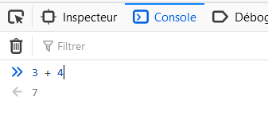

## Expression et opérateurs

Pour chaque exercice qui suit, utilisez la **console** afin d’obtenir les résultats de l’expression.

Vous pouvez tenter de prédire le résultat, sachant que le calcul mental aide à ralentir le vieillissement cognitif ( ͡❛ ͜ʖ ͡❛)

1. 151 + 352

**Réponse** :

2. 20 \* 51

**Réponse** :

3. 6 / 2 + 5

**Réponse** :

4. 1 \* 2 + 3 \*4

**Réponse** :

5. 7.5 / (0.5 + 2)

**Réponse** :

6. 151 \* 80 / 4 - 2

**Réponse** :

7. 151 \* 80 / (4 - 2)

**Réponse** :

8. 1 + 2 - 3 \* (4 + 5 \* 6 - (7 + 8) / 9)

**Réponse** :

## Déclaration et affectation de variables

Exceptionnellement, pour les exercices restants de cette semaine, vous devez obligatoirement utiliser **Mozilla Firefox**. À l’avenir, vous pourrez utiliser Firefox ou Chrome, au choix.

Pour les exercices suivants, répondez à l’aide de la **console** du navigateur. Ne réactualisez jamais la page du navigateur (Bouton 🔄 ou F5) à moins que ce soit demandé !

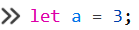

9. Déclarez la variable **a** et affectez-lui la valeur **3**. Ensuite, tapez simplement « **a** » dans la console. Qu’est-ce que la console vous retourne ? 🤔

**Réponse** :

10. Maintenant, déclarez la variable **b** sans lui affecter de valeur. 😳 Ensuite, tapez simplement « **b** » dans la console. Qu’est-ce que la console vous retourne ?

**Réponse** :

11. C’est fâcheux ! 😥 (Mais ce n’est pas grave) Affectez la valeur **10** à la variable **b** à l’aide de l’opérateur **=**. Copiez-collez la ligne de code que vous avez utilisée.

**Réponse** :

12. Déclarez (encore) la variable **b** et affectez-lui la valeur **5**. Pourquoi ça ne marche pas ?

**Réponse** :

🔄 Réactualisez maintenant la page du navigateur. (Ou appuyez sur F5 sur le clavier) La console va se vider, c’est normal.

13. Déclarez (encore 🙄) la variable **b** et affectez-lui encore la valeur **5**. Est-ce que ça fonctionne ?

**Réponse** :

14. Déclarez la variable **c** et affectez-lui **5 multiplié par 2**. Ensuite, tapez simplement « **c** » dans la console. Qu’est-ce que la console vous retourne ?

**Réponse** :

15. Demandez à la console combien vaut b + c. Qu’est-ce qui est retourné ?

**Réponse** :

16. Déclarez la variable **d** et affectez-lui la valeur des variables **b** et **c** multipliées. Ensuite, tapez « **d** » dans la console. Qu’est-ce qui est retourné ?

**Réponse** :

17. On a présentement trois variables déclarées :

    - **b** qui vaut **5**

    - **c** qui vaut **10**

    - **d** qui vaut **50**

En utilisant **seulement ces trois variables** (autant de fois que vous voulez) essayez d’obtenir le nombre **42** à l’aide d’opérateurs mathématiques. (**+**, **-**, **\***, **/**)

Voici un exemple d’équation utilisant les variables : (Mais qui ne donne pas **42** 😅)

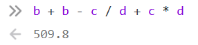

Indiquez l’équation que vous avez trouvée et qui donne 42. Si vous ne trouvez vraiment pas et que cela vous prend trop de temps, demandez de l’aide à l’enseignant(e) 😉

**Réponse** :

## Affectation de variables sophistiquée

Pour les exercices suivants, on utilise encore la **console** du navigateur.

🔄 Réactualisez maintenant la page du navigateur.

18. Déclarez la variable **bye** et affectez-lui la valeur **3**.

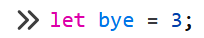

Ensuite, utilisez l’opérateur **+=** pour augmenter sa valeur de **5**.

Combien vaut **bye** maintenant ?

**Réponse** :

19. Utilisez maintenant l’opérateur **-=** pour réduire de **2** la valeur de la variable **bye**.

Combien vaut **bye** maintenant ?

**Réponse** :

20. Déclarez la variable **ilala** et affectez-lui la valeur **1**;

Trouvez comment faire pour remplacer la valeur **1** par la valeur **2** dans la variable **ilala** à l’aide de l’opérateur **=**.

**Réponse** **:**

21. Affectez la valeur **1** à la variable **ilala** à nouveau.

Trouvez comment faire pour remplacer la valeur **1** par la valeur **4** dans la variable **ilala** à l’aide de l’opérateur **+=**.

**Réponse** **:**

22. Affectez la valeur **1** à la variable **ilala** à nouveau. 😴

Trouvez comment faire pour remplacer la valeur **1** par la valeur **-5** dans la variable **ilala** à l’aide de l’opérateur **-=**.

**Réponse** **:**

🔄 Réactualisez maintenant la page du navigateur.

23. Déclarez plusieurs variables :

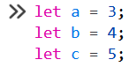

Affectez une nouvelle valeur à la variable **a** de cette manière :

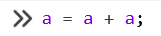

Combien vaut **a** maintenant ?

**Réponse** **:**

24. Affectez une nouvelle valeur à la variable **c** de cette manière :

Combien vaut **c** maintenant ?

**Réponse** **:**

25. Affectez une nouvelle valeur à la variable **b** de cette manière :

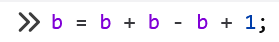

Combien vaut **b** maintenant ?

**Réponse** **:**

**Astuce avec Word** : Si le symbole **«** apparait quand vous vouliez plutôt écrire **"**, appuyez sur Ctrl + z pour que le **«** devienne un **"**. Cela dit, en général, c’est plus rapide de copier-coller ce que vous avez écrit dans la console du navigateur.

## Chaînes de caractères (texte)

Pour les exercices suivants, on utilise toujours la **console** du navigateur.

🔄 Réactualisez maintenant la page du navigateur.

26. Déclarez une variable nommée ville dans la console et affectez-lui la valeur "Paris". Copiez-collez votre ligne de code ici :

**Réponse** :

27. Concaténez la variable ville avec la chaîne de caractères " est la capitale de l’Espagne" comme ceci dans la console.

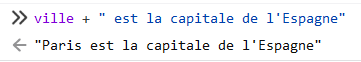

Assurez-vous que le résultat soit identique. Si le résultat est différent, réactualisez la page et recommencez les questions 26 et 27.

28. Si vous vérifiez la valeur de la variable ville, que contient-elle ?

**Réponse** :

29. Maintenant, faites l’opération suivante sur la variable ville :

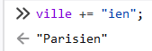

30. Que contient la variable ville maintenant ? Quelle est la différence entre l’opérateur + et l’opérateur += quand on utilise des chaînes de caractères ?

**Réponse** :

Si les dernières questions n’étaient pas claires, n’hésitez pas à demander de l’aide à l’enseignant(e) !

🔄 Vous pouvez réactualiser la page à ce moment.

31. Déclarez une variable nommée debutPhrase dans la console et affectez-lui la valeur "Never gonna".  Copiez-collez votre ligne de code ici :

**Réponse** :

32. Déclarez une variable nommée finPhrase dans la console et affectez-lui la valeur "give you up". Copiez-collez votre ligne de code ici :

**Réponse** :

33. Construisez un template string identique à celui ci-dessous. N’oubliez pas l’espace entre les 2 variables ! Vous devriez avoir un résultat **identique**.

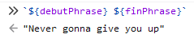

Si ce n’est pas le cas, réinitialisez la page (F5) et répétez les questions 31 à 33.

🔄 Vous pouvez réactualiser la page à ce moment.

34. Déclarez une variable nommée vehicule. Affectez-lui la valeur "jet privé".

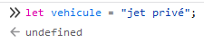

35. Déclarez une variable nommée phrase1. Affectez-lui le template string qui suit :

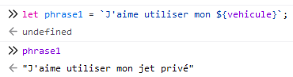

Si vous n’avez pas le même résultat, recommencez 9 et 10 !

36. Déclarez une variable nommée nombre. Affectez-lui la valeur 5.

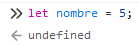

37. Déclarez une variable nommée phrase2. Affectez-lui le template string qui suit :

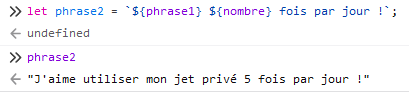

Si votre variable phrase2 ne contient pas le même texte, recommencez 34 à 37.

🔄 Vous pouvez réactualiser la page à ce moment.

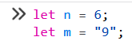

38. Déclarez la variable **n** et affectez-lui la valeur **6**. Pas "6", mais simplement 6, le *nombre*.

39. Déclarez ensuite la variable **m** et affectez-lui la valeur **"9"**. Notez que c’est une **chaîne de caractères**, pas un nombre, cette fois.

40. Écrivez l’équation **m + n** dans la console. Quel est le résultat ? C’est un nombre ou une chaîne de caractères ?

**Réponse** :

🔄 Vous pouvez réactualiser la page à ce moment.

41. Déclarez les variables suivantes dans la console :

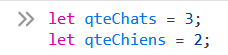

À l’aide d’un template string, tentez de reproduire la **phrase suivante** avec les variables déclarées plus haut :

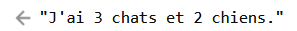

Les nombres 3 et 2 <u>doivent</u> être obtenus en utilisant les variables qteChats et qteChiens !

Voici un **exemple** pour vous aider à comprendre ce qu’il faut faire :

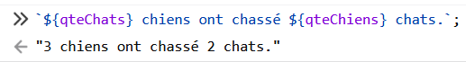

Copiez-collez votre template string qui vous a permis d’obtenir la phrase demandée plus haut :

**Réponse** :

🔄 Vous pouvez réactualiser la page à ce moment.

42. Déclarez les variables suivantes dans la console :

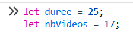

À l’aide d’un template string, tentez de reproduire la **phrase suivante** avec les variables déclarées plus haut :

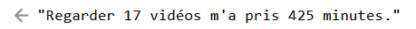

Le nombre 17 <u>doit</u> être obtenu en utilisant la variable nbVideos. Le nombre 425 <u>doit</u> être obtenu en multipliant les deux variables !

Copiez-collez votre template string qui vous a permis d’obtenir cette phrase :

**Réponse** :

N’oubliez pas de montrer ce **laboratoire complété** à votre enseignant(e) **avant de quitter.**
