# Laboratoire #3

## DOM, Visual Studio Code et fonctions

N’oubliez pas de montrer ce **laboratoire complété** à votre enseignant(e) **avant de quitter.**

**Astuce avec Word** : Si le symbole **«** apparait quand vous vouliez plutôt écrire **"**, appuyez sur Ctrl + z pour que le **«** devienne un **"**. Cela dit, en général, c’est plus rapide de copier-coller ce que vous avez écrit dans la console du navigateur.

## Exercice 1 - DOM (Document Object Model)

Dans le dossier « **lab3_exercice1** », faites un clic-droit sur le fichier « **index.html** » pour faire **Ouvrir avec** -> **Mozilla Firefox**. Ensuite, ouvrez l’outil **console** du navigateur sur cette page Web.

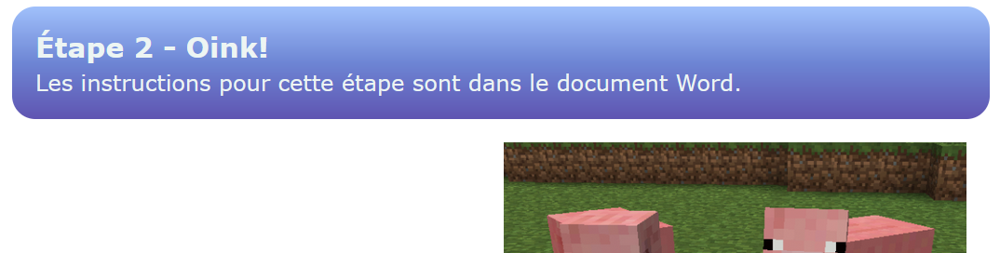

1. À l’aide de document.querySelector(...) et de .textContent, demandez à la console le **contenu textuel** de l’élément avec la classe « .**titre1** ». Qu’est-ce que la console vous retourne ?

Voici un exemple avec la mauvaise classe pour vous guider :

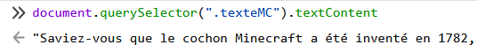

**Réponse** :

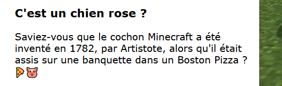

2. Modifier le contenu textuel de l’élément avec la classe « .**texteMC** ». On veut que son texte devienne **"Non, c’est un cochon."**. Ça va ressembler à la question précédente, mais on doit utiliser l’opérateur **=** pour remplacer le contenu textuel.

**Réponse** :

3. Trouvez le titre « Bokoblin » dans la page. Quel est la classe de cet élément ?

**Réponse** :

4. Maintenant que vous avez trouvé la classe de ce titre, servez-en-vous pour remplacer le contenu textuel de l’élément par **"Goomba"**. (Donc le titre Bokoblin sera remplacé par Goomba)

Copiez-collez la ligne de code que vous avez utilisée pour y arriver :

**Réponse** :

5. Commencez par récupérer le contenu textuel de l’élément avec la classe « .**titre3** » et stockez-le dans une nouvelle variable nommée titre. Si la variable contient "Peppa pig", c’est que vous avez bien fait cette étape.

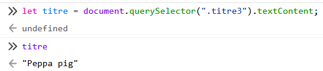

Ensuite, modifiez le contenu textuel de l’élément avec la classe « .**textePeppa** » en lui affectant la valeur que vous avez mise dans la variable titre. Vous n’êtes pas censés avoir besoin de rédiger "Peppa pig" vous-mêmes !

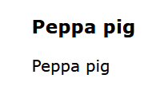

(Normalement, cela devrait avoir remplacé le paragraphe sous le titre Peppa pig par... « Peppa pig »)

Copiez-collez votre ligne de code ici :

**Réponse** :

🔄 Vous devez réactualiser la page à ce moment.

6. Cette fois, nous allons <u>ajouter du texte</u> à un paragraphe existant au lieu de le remplacer. Choisissez un mot parmi : « **Yikes**. », « **Cringe**. » ou « **Ouash**. ». Vous devez ajouter le mot que vous avez choisi à la fin du paragraphe sous le titre Peppa pig :

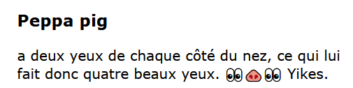

Pour que ça fonctionne, il faudra utiliser l’opérateur **+=** plutôt que **=** avec le textContent du paragraphe. Copiez-collez votre code ici.

**Réponse** :

🔄 Vous devez réactualiser la page à ce moment.

7. Pour conclure cette section, tentons quelque chose de plus complexe :

- Trouvez le moyen d’ajouter « Peppa pig » <u>au début</u> du paragraphe ci-dessous :

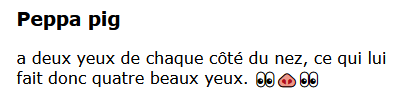 ... devient ... 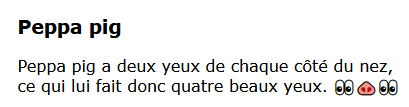

Pour y arriver, vous pourriez avoir besoin de créer une variable... Demandez de l’aide si vous n’y arrivez pas !

Copiez-collez votre code ici.

**Réponse** :

## Exercice 2 - Visual Studio Code et fonctions mystères

- Ouvrez le logiciel **Visual Studio Code**. Ensuite, ouvrez le dossier « **lab3_exercice2** » tel qu’expliqué dans les notes de cours.

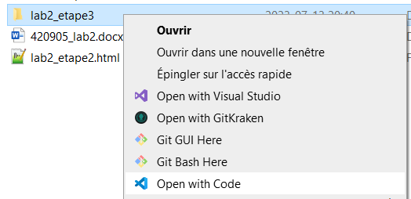 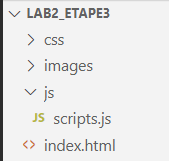

- Ouvrez la page Web « **index.html** » (du dossier lab3_exercice2) dans **Firefox**.  (En faisant clic-droit sur le fichier HTML pour l’ouvrir)

### Appeler des fonctions dans la console

Pour les exercices suivants, ouvrez la **console** du navigateur (sur la page **index.html**) et **appelez la fonction** demandée en vérifiant que l’effet obtenu est bien celui désiré. À tout moment, vous pouvez 🔄 réactualiser la page pour annuler les changements et recommencer.

Pour trouver la bonne **fonction** à appeler, dans Visual Studio Code, vous devrez examiner les fichiers « **scripts.js** » (Pour examiner les fonctions) et « **index.html** » (Pour trouver les éléments avec une classe particulière) dans **Visual Studio Code**.

8. Quel est la classe de l’élément HTML dont le texte est « Pomme 🍎 » ?

**Réponse** :

9. Quelle fonction permet de remplacer le texte « Pomme 🍎 » par le texte « Poire 🍐 » ? **Appelez cette fonction dans la console** pour être sûr que ça fonctionne, puis écrivez le nom de la fonction ci-dessous.

**Réponse** :

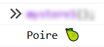

10. Quelle fonction permet d’imprimer le texte « Poire 🍐 » dans la console ? Testez la fonction dans la console pour vérifier votre réponse, puis écrivez le nom de la fonction ci-dessous.

**Réponse** :

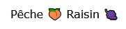

11. Quelle fonction ajoute le morceau de texte « Raisin 🍇 » juste après le contenu textuel « Pêche 🍑 » ? Appelez cette fonction dans la console pour être sûr que ça fonctionne.

**Réponse** :

## Exercice 3 - Créer vos propres fonctions

- Ouvrez le dossier « **lab3_exercice3** » avec Visual Studio Code.

- Ouvrez la page Web « **index.html** » (du dossier lab3_exercice3) dans **Firefox**.  (En faisant clic-droit sur le fichier HTML pour l’ouvrir)

### Créer vos propres fonctions

Pour l’exercice 3, les instructions sur les tâches à compléter seront présentées <u>directement dans le code, en commentaire</u>. Ainsi, rendez-vous le fichier **scripts.js** de **lab3_exercice3** pour lire les instructions sur les fonctions à créer.

N’oubliez pas de TESTER vos fonctions dans la console !

Les solutions sont dans le fichier script.js !

N’oubliez pas de montrer ce **laboratoire complété** à votre enseignant(e) **avant de quitter**
